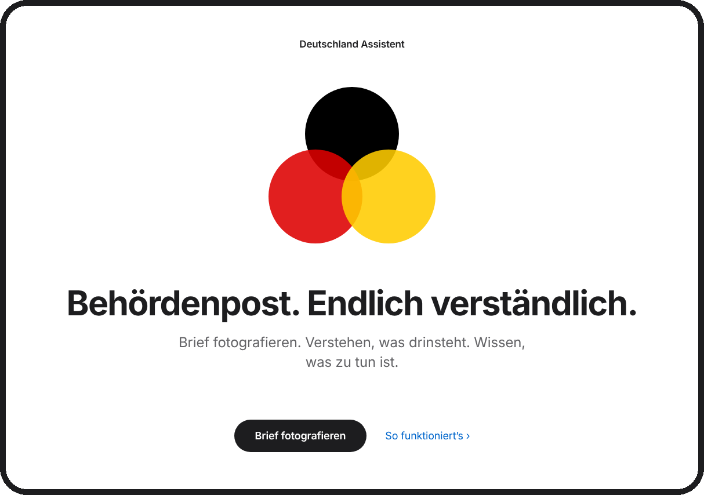
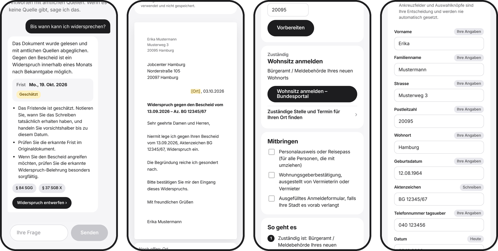
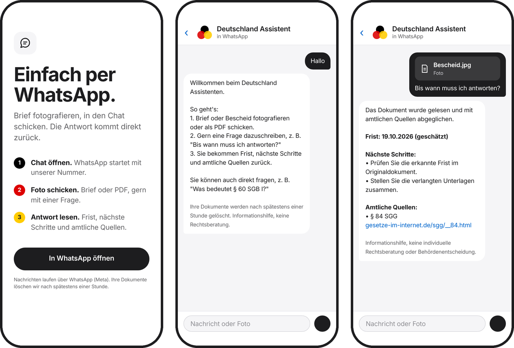

  

# Deutschland Assistent 🇩🇪

**Open-Source-Bürgerassistent für Deutschland: Behördenpost, Gesetze, Leistungen und nächste Schritte verständlich machen – mit nachvollziehbaren Quellen.**

Deutschland Assistent ist ein quelloffener, evidenzorientierter Bürgerassistent. Ziel ist, deutsche Verwaltung, Gesetze und persönliche Behördenpost verständlicher zu machen, ohne dass Nutzerinnen und Nutzer juristische Fachbegriffe, Behördenstrukturen oder besondere KI-Prompts kennen müssen.

> **Grundprinzip:** Das Modell ist nicht die Quelle der Wahrheit. Maßgeblich sind das Originaldokument und amtliche Quellen.

  

iPad-Ansicht

  

## Was v0.2.5 bereits kann

- PDFs, Textdateien sowie **Fotos und Scans** verarbeiten.
- Text, Datumsangaben, Fristen und häufige Rechtsverweise erkennen.
- Dokumente auch ohne LLM oder externen Modell-API-Schlüssel analysieren.
- **Docling lokal** für OCR und Layout-Erkennung bei Fotos, Scans und textarmen PDFs einsetzen; entfernte Docling-Dienste sind deaktiviert.
- Fristen, Rechtsverweise, LeiKa-IDs, Behördenhinweise sowie **angeforderte Unterlagen, Handlungen, Zahlungen** und **Rechtsbehelfsbelehrungen** strukturiert erkennen.
- Relative Fristen wie „innerhalb eines Monats nach Bekanntgabe“ erkennen und konservativ ein mögliches Fristende schätzen. Geschätzte Fristen werden ausdrücklich als unsicher gekennzeichnet.
- Hochgeladene Dokumente standardmäßig nur temporär im Speicher halten, mit Ablaufzeit, Größenbegrenzung und Lösch-Endpunkt.
- Explizite Gesetzeszitate direkt mit **Gesetze im Internet** verknüpfen.
- Bundesrecht und Rechtsprechung über die offizielle **Rechtsinformationen-des-Bundes-API** durchsuchen; inklusive Datumsfiltern, Pagination, ELI/ECLI-Metadaten und Detailabruf einzelner Entscheidungen. Explizite Gesetzeszitate behalten einen direkten amtlichen Fallback.
- Häufige Leistungen gegen ein nachvollziehbares Register offizieller Quellen abgleichen.
- Strukturierte, gerankte Evidenz zu einer Antwort zurückgeben.
- Fragen über eine einfache Weboberfläche stellen – auch **im Gespräch mit Rückfragen**; jede Antwort bleibt an amtliche Quellen gebunden.
- **Antwortschreiben** entwerfen: Widerspruch bzw. Einspruch, Bitte um Fristverlängerung, Nachreichung von Unterlagen – mit Datum, Aktenzeichen und Behörde aus dem Brief.
- **Behördentermine vorbereiten**: zuständige Stelle und offizielle Buchungsseite über das Bundesportal, Unterlagen-Checkliste; gebucht wird von der Person selbst.
- **PDF-Formulare ausfüllen**: Felder erkennen, Werte aus den eigenen Angaben vorschlagen, prüfen, ausgefülltes PDF herunterladen.
- WhatsApp anbinden: Texte, Fotos und Dokumente können über die WhatsApp Cloud API in denselben Analyse-Workflow gelangen.
- OpenClaw als optionalen Kanal-/Agent-Gateway nutzen, ohne die fachliche Logik dorthin zu verlagern.
- Optional ein **in Deutschland betriebenes, OpenAI-kompatibles Sprachmodell** als reine Erklärungsschicht hinter der Evidence Engine verwenden. Ohne Konfiguration bleibt der bisherige deterministische Modus aktiv.

## Neu in v0.2.5: Der Assistent bereitet vor

  

Der Assistent erklärt nicht nur, er **bereitet die nächsten Schritte vor**. Entscheiden, unterschreiben, abschicken und buchen bleibt immer bei der Person.

| | Was passiert | Was nie automatisch passiert |
|---|---|---|
| **Fragen** (`POST /v1/chat`) | Gespräch mit Rückfragen; jede Antwort läuft durch dieselbe evidenzgebundene Pipeline wie `/v1/ask`. Passende nächste Schritte werden als Buttons vorgeschlagen. | Antworten ohne Quelle als Tatsache ausgeben |
| **Antworten** (`POST /v1/letters/draft`) | Widerspruch/Einspruch, Fristverlängerung oder Nachreichung aus geprüften Vorlagen, mit Datum, Aktenzeichen und Behörde aus dem Brief. Fehlende Angaben bleiben als markierte `[Lücke]` stehen. | Unterschreiben, Absenden |
| **Termin** (`POST /v1/appointments/prepare`) | Zuständige Stelle und Buchungsweg über das Bundesportal (mit Postleitzahl direkt für den eigenen Ort), Unterlagen-Checkliste, Online-Alternative wo vorhanden. | Termin buchen |
| **Ausfüllen** (`POST /v1/forms` …) | PDF-Formularfelder erkennen, Werte aus den eigenen Angaben und dem Brief vorschlagen, ausgefülltes PDF zum Herunterladen. | Ankreuzfelder setzen, unterschreiben, einreichen |

Leitplanken:

- **Briefe kommen aus festen Vorlagen**, nicht aus dem Sprachmodell. Der Wortlaut eines Widerspruchs darf nicht vom Modell abhängen.
- **Gesetzliche Fristen** (Widerspruch, Einspruch, Klage) lassen sich nicht verlängern; der Assistent schlägt in diesem Fall keine Fristverlängerung vor und warnt, wenn man sie trotzdem wählt.
- **Formularwerte stammen nur aus den Angaben der Person oder dem Brief.** Das Sprachmodell darf optional zuordnen, *welches* Feld zu welcher Angabe passt – es sieht dabei nur Feldbezeichnungen und die Namen der Angaben, nie die Werte.
- **Chat-Verlauf** wird nur zum Verständnis von Rückfragen genutzt und als zitierter Kontext übergeben, nie als Anweisung. Der Server speichert ihn nicht; die Web-App schickt ihn bei jeder Frage mit.
- Hochgeladene Formulare gelten wie Dokumente nur temporär (`DOCUMENT_TTL_SECONDS`) und lassen sich mit `DELETE /v1/forms/{id}` sofort löschen.
- Die Unterlagen-Checklisten nennen, was üblicherweise verlangt wird. Verbindlich ist die Liste der zuständigen Stelle.

## Neu in v0.2.4

Die amtliche Rechtsrecherche ist jetzt ein eigener, robuster Baustein der Evidence Engine:

- **Rechtsinformationen des Bundes** für Bundesrecht und Rechtsprechung.
- **ELI** für Gesetzgebung und **ECLI** für Rechtsprechung werden als strukturierte Identifier übernommen, sofern vorhanden.
- Rechtsprechung kann nach Datum gefiltert und paginiert durchsucht werden.
- Die wichtigsten Treffer können über den amtlichen Detail-Endpunkt nachgeladen werden.
- Aus vollständigen Entscheidungen können unter anderem Leitsatz, Orientierungssatz, Tenor, Tatbestand und Entscheidungsgründe als Evidenz verwendet werden.
- Für Entscheidungen werden direkte JSON-, HTML- und XML-Repräsentationen hinterlegt.
- Ein kurzer TTL-Cache reduziert unnötige Wiederholungsanfragen.
- HTTP 429 und temporäre Serverfehler werden mit begrenztem Retry und Backoff behandelt.
- Ein täglicher GitHub-Actions-Smoke-Test prüft die amtlichen Such-Endpunkte unabhängig vom Nutzerverkehr.

Parallel dazu kann die Erklärungsschicht über einen **in Deutschland betriebenen LLM-Endpunkt** laufen. Der deterministische Kern bleibt davon unabhängig.

> **Leitprinzip:** Das Modell formuliert. Die Evidenz entscheidet, was behauptet werden darf.

## Was eine Dokumentantwort enthalten soll

Nach dem Upload oder Foto eines Behördenbriefs kann der Assistent Informationen getrennt ausgeben:

- **Was ist das für ein Schreiben?**
- **Was bedeutet es?**
- **Welche Frist wurde erkannt?**
- **Was verlangt die Behörde?**
- **Welche Unterlagen fehlen?**
- **Gibt es einen Rechtsbehelf wie Widerspruch oder Klage?**
- **Welche Rechtsgrundlagen werden genannt?**
- **Welche amtlichen Quellen passen dazu?**
- **Was sind sinnvolle nächste Schritte?**
- **Was ist noch unsicher oder unklar?**

## Leitstern des Projekts

Der wichtigste End-to-End-Anwendungsfall ist bewusst einfach:

    Behördenbrief fotografieren
            ↓
    Dokument verstehen
            ↓
    Fristen und Anforderungen erkennen
            ↓
    amtliche Quellen zuordnen
            ↓
    verständlich erklären
            ↓
    nächste Schritte vorbereiten

Alles, was diesen Ablauf zuverlässiger, verständlicher oder sicherer macht, hat Vorrang vor zusätzlicher Oberfläche.

## Aktueller End-to-End-Datenfluss

    Foto / PDF / Text
            ↓
      Docling / Parser
            ↓
    deterministische Extraktion
      ├─ Dokumenttyp
      ├─ Behörde
      ├─ Fristen
      ├─ Anforderungen
      ├─ Rechtsbehelf
      └─ Gesetzeszitate
            ↓
       Evidence Engine
      ├─ Gesetze im Internet
      ├─ Rechtsinformationen des Bundes
      │    ├─ Gesetzgebung
      │    ├─ Rechtsprechung
      │    ├─ ELI / ECLI
      │    └─ Entscheidungs-Detaildaten
      └─ amtliche Leistungsquellen
            ↓
    strukturierter Evidence Context
            ↓
      ┌───────────────┬────────────────────┐
      │ deterministisch│ optionales LLM    │
      │    fallback    │ in Deutschland    │
      └───────────────┴────────────────────┘
            ↓
       Evidence-Gating
            ↓
    verständliche Bürgerantwort

Der vollständige Originalbrief wird für die optionale LLM-Erklärung **nicht standardmäßig weitergereicht**. Stattdessen erhält das Modell einen minimierten Kontext aus bereits extrahierten Fakten und amtlichen Evidenzbausteinen.

## Architektur

                          Bürger:in
                              │
            ┌─────────────────┼─────────────────┐
            │                 │                 │
           Web            OpenClaw          WhatsApp
            │          optionaler Gateway       │
            └─────────────────┼─────────────────┘
                              ▼
                      Channel Gateway
                              │
                              ▼
                  Deutschland Assistent Core
        Intent → Dokument → Retrieval → Evidence
                              │
                 ┌────────────┼────────────┐
                 ▼            ▼            ▼
              Docling      Rechtsquellen  Leistungen
                OCR
                              │
                              ▼
                       Evidence Engine
                              │
                              ▼
               strukturierter Evidence Context
                              │
                    ┌─────────┴─────────┐
                    │                   │
                    ▼                   ▼
           deterministischer      optionales LLM
               Fallback          in Deutschland
                    │                   │
                    └─────────┬─────────┘
                              ▼
                      verständliche Ausgabe

### Architekturregeln

- **Kanäle sind Adapter.** WhatsApp, OpenClaw oder Web enthalten keine eigene Rechtslogik.
- **Evidenz ist ein Kernobjekt.** Wichtige Aussagen sollen auf Dokumentstellen oder amtliche Quellen zurückführbar sein.
- **Folgenreiche Aktionen brauchen Bestätigung.** Anträge, Widersprüche, Kündigungen oder andere rechtlich relevante Erklärungen werden nicht autonom abgeschickt.
- **Kein Modell-Lock-in.** Der deterministische Kern funktioniert ohne LLM; Modelle können hinter einer Provider-Schnittstelle ergänzt werden.
- **Minimale Datenhaltung.** Persönliche Dokumente sollen standardmäßig nur so lange gespeichert werden, wie es für die Verarbeitung nötig ist.
- **Unsicherheit bleibt sichtbar.** Eine geschätzte Frist oder ein semantischer Suchtreffer darf nicht wie eine amtlich feststehende Tatsache aussehen.
- **Das LLM formuliert, die Evidenz begrenzt.** Das Modell erhält strukturierte Fakten und amtliche Evidenzbausteine statt standardmäßig den vollständigen Brief. Aussagen ohne bekannte Evidence-ID werden verworfen; neue Datums- oder Paragraphenangaben müssen in der referenzierten Evidenz vorkommen.

## Projektplan

Die ausführliche Planung liegt in [docs/PROJEKTPLAN.md](docs/PROJEKTPLAN.md).

| Phase | Ziel |
|---|---|
| **v0.2.3** | Öffentlicher Behördenbrief-Benchmark und messbare Qualitätsmetriken |
| **v0.2.4** | Evidence Engine 2.0 mit breiterer amtlicher Wissensschicht und Source Monitoring |
| **v0.3** | Bürger-Workflows: von „verstehen“ zu „vorbereitet handeln“ |
| **v0.4** | Mehrsprachigkeit, Einfache Sprache und Barrierefreiheit |
| **v0.5** | Produktionshärtung, Skalierung, Observability und Datenschutz |
| **v1.0** | Belastbare offene Bürger-Infrastruktur für Deutschland |

Die kompakte Release-Roadmap steht in [docs/ROADMAP.md](docs/ROADMAP.md).

## Schnellstart

### Variante A – Docker

    cp .env.example .env
    docker compose up --build

Danach:

- Web: http://localhost:3000
- API-Dokumentation: http://localhost:8000/docs
- Healthcheck: http://localhost:8000/health

### Variante B – ohne Docker

Benötigt Python 3.11+ und Node.js 20+.

Backend:

    cd services/civic-core
    python3.12 -m venv .venv
    source .venv/bin/activate
    pip install -e '.[dev]'
    python -m uvicorn deutschland_assistent.main:app --reload --port 8000

Weboberfläche:

    cd apps/web
    npm install
    npm run dev

Docling/OCR lokal installieren:

    pip install -e '.[docling]'

## Beispiel-API

Frage stellen:

    curl -X POST http://localhost:8000/v1/ask \
      -H 'Content-Type: application/json' \
      -d '{"message":"Was bedeutet § 60 SGB I?","language":"de"}'

Dokument hochladen:

    curl -X POST http://localhost:8000/v1/documents \
      -F 'file=@bescheid.pdf'

## Wichtige API-Endpunkte

- POST /v1/evidence/search – amtliche Wissensschicht durchsuchen.
- GET /v1/sources – Quellen, Rollen und Status anzeigen.
- GET /v1/channels – öffentliche Verbindungsdaten für Kommunikationskanäle ausgeben.
- POST /v1/documents – Dokument analysieren und strukturierte Fakten extrahieren.
- DELETE /v1/documents/{id} – hochgeladenes Dokument vor Ablauf der TTL löschen.
- POST /v1/ask – Dokumentinformationen und amtliche Evidenz zu einer Antwort verbinden.
- POST /v1/chat – Gespräch mit Verlauf; Antwort wie /v1/ask plus vorgeschlagene nächste Schritte.
- POST /v1/letters/draft – Antwortschreiben (Widerspruch/Einspruch, Fristverlängerung, Nachreichung) als Entwurf.
- POST /v1/appointments/prepare – zuständige Stelle, Buchungsweg und Unterlagen-Checkliste für ein Anliegen.
- POST /v1/forms – PDF-Formular hochladen und Felder erkennen.
- POST /v1/forms/{id}/suggest – Feldwerte aus eigenen Angaben und dem Brief vorschlagen.
- POST /v1/forms/{id}/fill – ausgefülltes PDF herunterladen.
- DELETE /v1/forms/{id} – Formular vor Ablauf der TTL löschen.

## Konfiguration

| Variable | Standard | Bedeutung |
|---|---|---|
| CORS_ORIGINS | http://localhost:3000 | erlaubte Origins |
| DOCUMENT_ENGINE | auto | basic, docling oder auto |
| MAX_UPLOAD_BYTES | 15728640 | maximale Uploadgröße |
| MAX_DOCUMENT_PAGES | 30 | maximale Seitenzahl pro Dokument |
| DOCLING_ARTIFACTS_PATH | /opt/docling-models | lokaler Docling-Modellcache |
| PREFETCH_DOCLING_MODELS | 0 | Docling-Modelle beim Image-Build vorladen |
| DOCUMENT_TTL_SECONDS | 3600 | Verweildauer eines Dokuments im Speicher |
| MAX_STORED_DOCUMENTS | 500 | maximale Zahl gleichzeitig gespeicherter Dokumente |
| NEURIS_BASE_URL | https://testphase.rechtsinformationen.bund.de | Basis der amtlichen Rechtsinformationen-API |
| NEURIS_TIMEOUT_SECONDS | 8 | Timeout pro API-Aufruf |
| NEURIS_CACHE_TTL_SECONDS | 900 | TTL des lokalen API-Caches |
| NEURIS_MAX_RETRIES | 2 | Wiederholungen bei 429/5xx |
| NEURIS_ENRICH_CASE_LAW | true | wichtige Rechtsprechungstreffer über den Detail-Endpunkt anreichern |
| LLM_PROVIDER | disabled | disabled, germany_hosted, openai_compatible oder ollama |
| LLM_BASE_URL | – | OpenAI-kompatibler /v1-Endpunkt |
| LLM_MODEL | – | Modellname am Inferenz-Endpunkt |
| LLM_API_KEY | – | optionaler API-Schlüssel; nie committen |
| LLM_REGION | DE | bei germany_hosted zwingend DE |
| LLM_TIMEOUT_SECONDS | 60 | Timeout der Erklärungsschicht |
| LLM_MAX_TOKENS | 900 | maximale Antwortlänge der Erklärungsschicht |
| WHATSAPP_PUBLIC_NUMBER | – | öffentliche WhatsApp-Nummer im E.164-Format |
| WHATSAPP_GREETING | Hallo | vorausgefüllte Begrüßung im Chat |
| WHATSAPP_APP_SECRET | – | Prüfung der Meta-Webhook-Signatur; in Produktion erforderlich |
| MAX_WHATSAPP_MEDIA_BYTES | 15728640 | maximale WhatsApp-Mediendateigröße |

## Rechtsinformationen des Bundes

Die Evidence Engine nutzt die offizielle API der Rechtsinformationen des Bundes tiefer als nur für Suchtreffer:

- `/v1/legislation` für aktuelle Bundesgesetzgebung
- `/v1/case-law` für Rechtsprechung
- `/v1/case-law/{documentNumber}` für vollständige Entscheidungsdaten
- direkte HTML- und XML-Repräsentationen einzelner Entscheidungen
- ELI/ECLI, Gericht, Entscheidungsdatum und Dokumentnummer als strukturierte Metadaten
- Datumsfilter und Pagination
- exakte Phrasensuche
- TTL-Cache und Retry/Backoff bei temporären Fehlern
- täglicher GitHub-Actions-Smoke-Test

Die wichtigsten Rechtsprechungstreffer können über den amtlichen Detail-Endpunkt angereichert werden. Dabei werden zum Beispiel Leitsatz, Orientierungssatz, Tenor oder Entscheidungsgründe als Evidenz verwendet, sofern vorhanden.

### Was aus der Rechts-API als Evidenz genutzt werden kann

Bei Rechtsprechung unterscheidet der Assistent zwischen Suchtreffer und vollständiger Entscheidung. Ein relevanter Treffer kann über seine Dokumentnummer erneut geladen und mit amtlichen Detailfeldern angereichert werden.

Beispiel für die interne Evidenzkette:

    § 60 SGB I im Behördenbrief
            ↓
    amtliche Normquelle
            ↓
    Suche in Rechtsinformationen des Bundes
            ↓
    relevante Gerichtsentscheidung
            ↓
    Dokumentnummer + ECLI
            ↓
    vollständiger Detailabruf
            ↓
    Leitsatz / Tenor / Entscheidungsgründe
            ↓
    evidenzbeschränkte Erklärung

Rechtsprechung bleibt dabei eine eigene Evidenzart und wird **nicht** wie eine Gesetzesnorm behandelt.

Die API befindet sich weiterhin in der Testphase. Deshalb bleibt **Gesetze im Internet** für explizite Normzitate ein unabhängiger amtlicher Fallback.

## Deutschland-gehostetes Sprachmodell

Die Erklärungsschicht ist optional. Standardmäßig läuft der Civic Core weiterhin ohne LLM:

    LLM_PROVIDER=disabled

Für einen OpenAI-kompatiblen Inferenz-Endpunkt, dessen Betrieb und Datenverarbeitung vertraglich und technisch in Deutschland abgesichert sind:

    LLM_PROVIDER=germany_hosted
    LLM_BASE_URL=https://<ihr-endpunkt>/v1
    LLM_MODEL=<modellname>
    LLM_API_KEY=<secret>
    LLM_REGION=DE

Der Core sendet an diese Schicht standardmäßig **nicht den vollständigen Originalbrief**, sondern strukturierte, bereits extrahierte Fakten sowie amtliche Evidenzbausteine. Das Modell muss JSON mit Evidence-IDs zurückgeben. Unbekannte Evidence-IDs sowie neue, nicht belegte Datums- oder Paragraphenangaben werden verworfen.

Wichtig: Die Einstellung `LLM_REGION=DE` ist nur eine technische Konfigurationssperre und **kein Nachweis für Datenresidenz**. Betreiber müssen Hosting-Standort, Auftragsverarbeitung, Unterauftragsverarbeiter, Logging, Retention und Trainingsnutzung unabhängig prüfen.

## WhatsApp

  

Über WhatsApp kann eine Person einen Text, ein Foto oder ein PDF senden. Der Adapter übergibt die Nachricht an denselben Dokument- und Evidence-Workflow wie die Weboberfläche und sendet die strukturierte Antwort zurück.

    Web-App ──GET /v1/channels──▶ Civic Core
    WhatsApp ──Webhook──▶ WhatsApp-Cloud-Adapter ──▶ /v1/documents + /v1/ask
                                                 │
                                                 └──▶ WhatsApp Cloud API

### Einrichtung

1. In der Meta-Entwickleroberfläche eine App mit dem Produkt **WhatsApp** erstellen und eine Geschäftsnummer registrieren.
2. Die nötigen Werte in .env hinterlegen.
3. Stack inklusive Adapter starten:

       docker compose --profile whatsapp up --build

4. Den Adapter über HTTPS erreichbar machen und /webhook in Meta hinterlegen.
5. Eine Nachricht oder ein Dokument an die Nummer senden.

**Hinweis:** WhatsApp ist ein externer Dienst von Meta. Eine Nutzung über WhatsApp ist daher datenschutztechnisch nicht identisch mit einem lokal oder selbst gehosteten Web-Upload.

## OpenClaw

Der optionale OpenClaw-Skill liegt unter channels/openclaw/deutschland-assistent/.

    openclaw skills install ./channels/openclaw/deutschland-assistent --as deutschland-assistent
    export DEUTSCHLAND_ASSISTENT_API=http://localhost:8000

Die Integration bleibt bewusst schmal: Sie leitet Bürgerfragen und Dokumentanalysen an den Civic Core weiter. Unbeschränkter Shell-, Browser- oder Dateisystemzugriff gehört nicht in einen öffentlich erreichbaren Agenten.

## Repository-Struktur

    apps/web/                                   Bürgeroberfläche
    services/civic-core/                        FastAPI-Kern
      deutschland_assistent/extraction.py       deterministische Extraktion
      deutschland_assistent/evidence.py         amtliche Evidence Engine
      deutschland_assistent/documents.py        PDF-/OCR-Dokumentverarbeitung
      deutschland_assistent/schemas.py          Antwort- und Evidenzschema
    channels/openclaw/                          optionaler OpenClaw-Skill
    channels/whatsapp-cloud/                    WhatsApp-Cloud-Adapter
    docs/                                       Architektur, Quellen, Roadmap, Projektplan

## Amtliche Datenquellen

Die Quellenstrategie ist bewusst konservativ. Bevor eine Quelle als maßgeblich behandelt wird, sollen Herkunft, Zuständigkeit, Format und Aktualität nachvollziehbar sein.

Aktuell bzw. vorgesehen:

- **Gesetze im Internet**
- **Rechtsinformationen des Bundes / NeuRIS**
- **Bundesportal / LeiKa**
- **Bundesagentur für Arbeit / Familienkasse**
- **Deutsche Rentenversicherung**
- **Bundesministerium für Gesundheit**
- weitere amtliche Bundes-, Landes- und Kommunalquellen

Details: [docs/DATA_SOURCES.md](docs/DATA_SOURCES.md)

## Sicherheit und rechtliche Grenzen

Deutschland Assistent soll **Informationszugang und Unterstützung** bieten, aber keine autonome Rechtsentscheidung treffen.

Bei rechtlich relevanten Aktionen gilt:

    Vorbereiten
       ↓
    Vorschau
       ↓
    ausdrückliche Bestätigung
       ↓
    Ausführen

Der Assistent selbst führt keine rechtlich relevante Handlung aus: Er schickt keine Briefe ab, bucht keine Termine, reicht keine Formulare ein, setzt keine Ankreuzfelder und unterschreibt nichts. Er bereitet vor; die Person prüft und handelt.

Siehe außerdem:

- [Sicherheit](SECURITY.md)
- [Quellenrichtlinie](SOURCE_POLICY.md)
- [Modellrichtlinie](MODEL_POLICY.md)
- [Transparenz](TRANSPARENCY.md)
- [Threat Model](docs/THREAT_MODEL.md)

## Mitmachen

Beiträge sind ausdrücklich willkommen. Besonders hilfreich sind:

- neue amtliche Quellen und Connectoren,
- synthetische oder vollständig anonymisierte Testdokumente,
- bessere Extraktion von Fristen und Behördenanforderungen,
- Übersetzungen und Einfache Sprache,
- Accessibility,
- Sicherheitsprüfungen,
- Evaluations- und Benchmarking-Arbeit.

Bitte keine echten Bürgerdokumente, Zugangsdaten oder personenbezogenen Daten committen.

Siehe [CONTRIBUTING.md](CONTRIBUTING.md).

## Entwicklung und Tests

    make test

Neue Funktionen mit potenziell großen Folgen für Bürgerinnen und Bürger sollten nicht nur neue Features, sondern auch passende Tests und Evaluationen mitbringen.

## Was noch nicht als produktionsreif gilt

v0.2.4 ist weiterhin eine frühe Alpha. Insbesondere:

- Der öffentliche Behördenbrief-Benchmark mit 200–500 Testfällen ist noch nicht abgeschlossen.
- OCR auf realen Smartphone-Fotos braucht noch systematische Qualitäts- und Regressionstests.
- Die Rechtsinformationen des Bundes befinden sich in der Testphase; Schema und Datenbestand können sich verändern.
- Das Evidence-Gating verhindert bereits bestimmte unbelegte Modellbehauptungen, ist aber noch kein vollständiger semantischer Wahrheitsbeweis.
- `LLM_REGION=DE` ist nur eine technische Konfiguration. Tatsächliche Datenresidenz, Zero-Retention, AVV und Unterauftragsverarbeiter müssen für den konkreten Provider separat geprüft werden.
- Folgenreiche Bürgeraktionen wie das tatsächliche Einreichen eines Widerspruchs bleiben bewusst außerhalb der aktuellen automatischen Ausführung.

Diese Punkte sind Teil der Roadmap und des geplanten öffentlichen Benchmarks.

## Status

**v0.2.5 – frühe Alpha-Version.**

Die OCR-Dokumentverarbeitung, strukturierte Extraktion von Anforderungen und Rechtsbehelfen, die vertiefte amtliche Rechtsinformationen-Integration sowie eine optionale evidenzbeschränkte LLM-Erklärungsschicht sind implementiert. Neu sind Chat, Antwortschreiben, Terminvorbereitung und der PDF-Formular-Agent. Schnittstellen und Datenmodelle können sich noch ändern.

## Lizenz

Eigener Projektcode steht – sofern in einzelnen Dateien nicht anders angegeben – unter **Apache-2.0**. Externe Komponenten und Datenquellen behalten ihre jeweiligen Lizenzen und Nutzungsbedingungen.

## Logo-Animation

Das Logo ist bewusst lebendig: Die drei Kreise in Schwarz, Rot und Gold bewegen sich zeitversetzt auseinander und wieder zusammen, während sich der gesamte Cluster langsam dreht. Durch die Überlagerungen entstehen wechselnde Farbmischungen.

Die README verwendet assets/logo-animated.svg. Die Web-App nutzt eine eigene CSS-Animation. Bei aktivierter Systemeinstellung „Bewegung reduzieren“ wird die Bewegung entsprechend reduziert bzw. deaktiviert.
